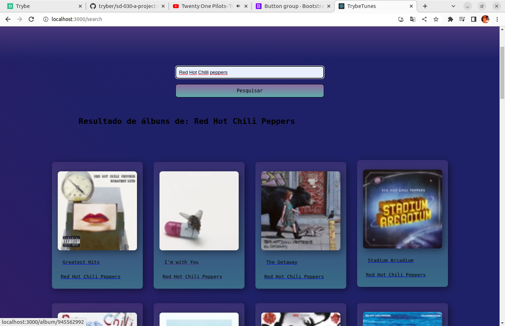
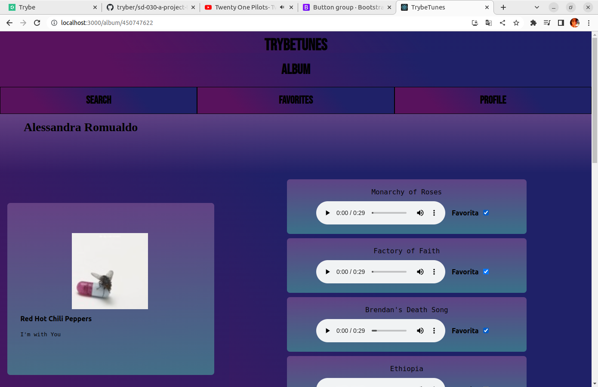
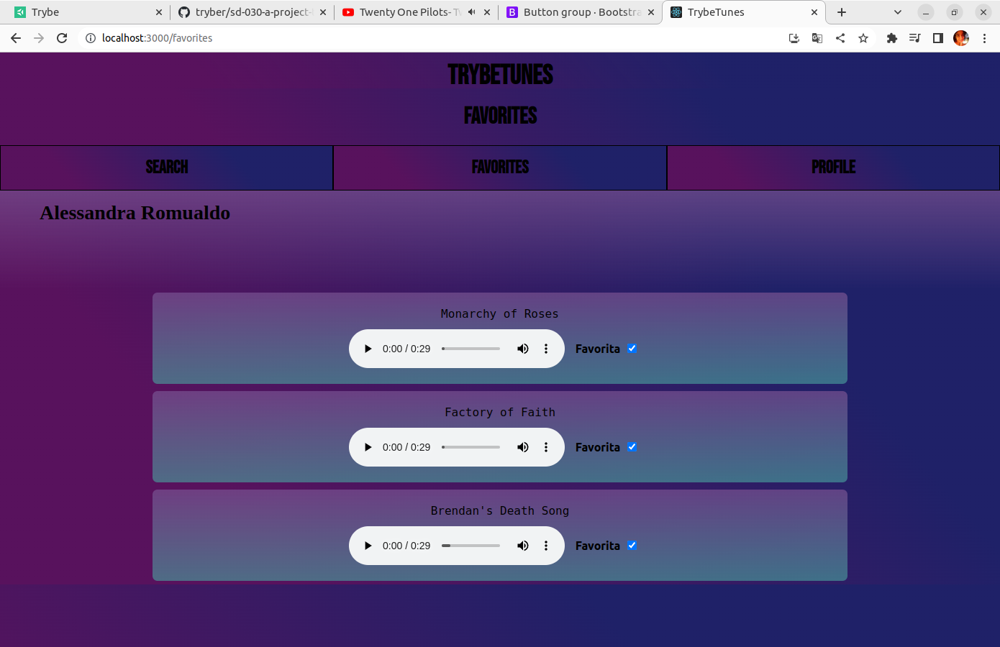
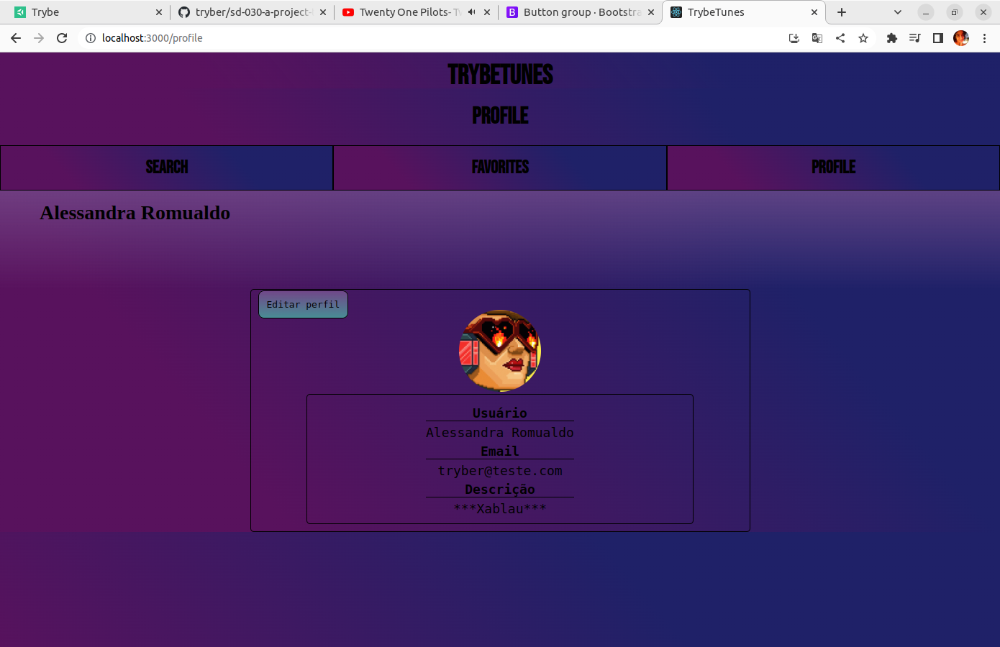
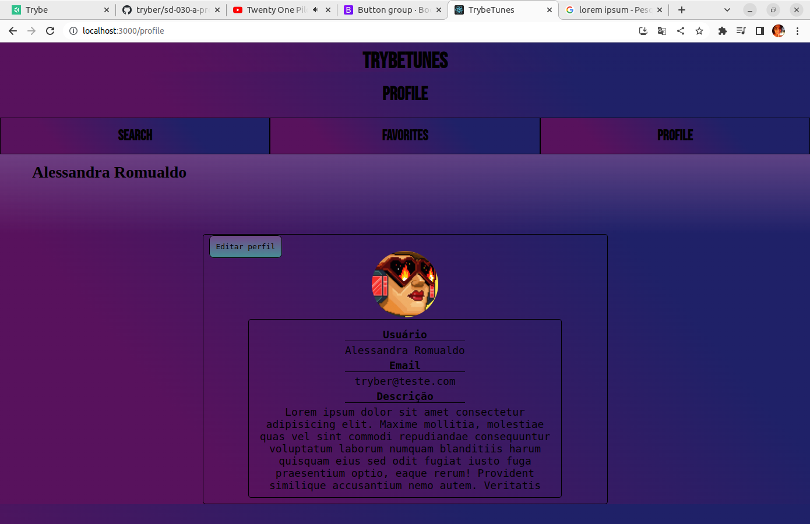

### :headphones: Projeto feito durando o curso da Trybe no modulo de Frontend

:pushpin: [Acessar Aplicação](https://trybe-tunes-self.vercel.app/)               

:pushpin: - Projeto feito com React usando react-router-dom versão 5.
:pushpin: - Foram aplicados: componentização, rotas, consumo de API, states e props.

  
  
  
  
  

